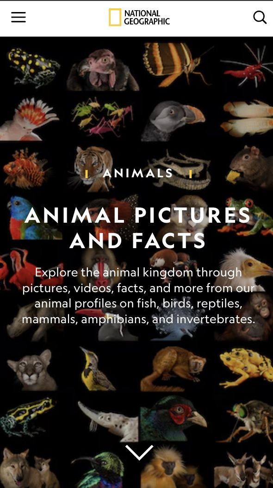
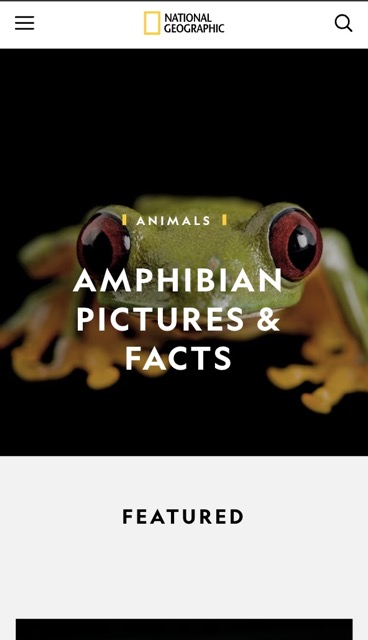
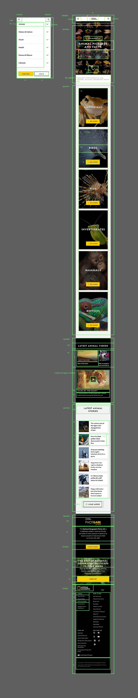

# Procesverslag
Markdown is een simpele manier om HTML te schrijven.  
Markdown cheat cheet: [Hulp bij het schrijven van Markdown](https://github.com/adam-p/markdown-here/wiki/Markdown-Cheatsheet).

Nb. De standaardstructuur en de spartaanse opmaak van de README.md zijn helemaal prima. Het gaat om de inhoud van je procesverslag. Besteedt de tijd voor pracht en praal aan je website.

Nb. Door *open* toe te voegen aan een *details* element kun je deze standaard open zetten. Fijn om dat steeds voor de relevante stuk(ken) te doen.

## Jij

  
uitwerken voor kick-off werkgroep

  ### Auteur:
  Quinten Weimer

  #### Je startniveau:
  Blauw

  #### Je focus:
  Responsive
 

## Je website

  
uitwerken voor kick-off werkgroep

  ### Je opdracht:
  https://www.nationalgeographic.com/

  #### Screenshot(s) van de eerste pagina (small screen): 
  Animal Profiles
  

  #### Screenshot(s) van de tweede pagina (small screen):
  Amphibians
  
  
 <!--  NOG IMAGES TOEVOEGEN -->

## Toegankelijkheidstest 1/2 (week 1)

  
uitwerken na test in 2e werkgroep

  ### Bevindingen
  Lijst met je bevindingen die in de test naar voren kwamen:

  Hij springt van h1 naar h5 en daarna komen er bijna alleen meer h2’s ookal is er een duidelijke hierarchie aanwezig in het design. Hij laat de submenu’s van de nav niet zien, je kan ze alleen klikken (werkt nu met hover) Forms snapt hij niet helemaal, video’s vind hij forms Landmarks doen raar. De pagina mist gebruik van elementen waar ze zouden moeten zijn, geen duidelijke uls, articles, etc. veel nikszeggende html.

  Uit checklist:
  - Buttons en links zijn niet descriptive genoeg
  - HTML is niet valid
  - Scroll area is soms te klein. Bij de categorien bv
  - Headings zijn onlogisch
  - List elements worden niet (goed) toegepast
  - De pagina heeft images zonder alt
  - Geen transcripts beschikbaar
  - Links zoals 'animals' is niet herkenbaar als link
  - skip link niet gevonden
  - Geen dark of HC mode
  - Video kan niet worden gepauzeerd als je wegscrollt.
  - geen custom ::selection colors
  - Geen aria labels

## Breakdownschets (week 1)

  
uitwerken na afloop 3e werkgroep

  Ben ik nog mee bezig, ik heb de schets maar niet een IMG ervan. Krijg niet in markdown..

  ### de hele pagina: 
  

  ### dynamisch deel (bijv menu): 
  

  ### wellicht nog een dynamisch deel (bijv filter): 
  

## Voortgang 1 (week 2)

  
uitwerken voor 1e voortgang

  ### Stand van zaken
  HTML gaat goed, ik vind het alleen lastig om de CSS selectoren consistent te houden, het word snel een zootje en dan raak ik een beetje kwijt hoe ik alles aanspreek. Verder vind ik werken met images en grote vlakken soms lastig, de layout word snel rommelig.

  ### Agenda voor meeting
  
  ## Quincy
- Volgorde van HTML  
- CSS border van `<li>`  
- …  

## Beyzanur
- Nav menu  
- HTML elementen/tags  
- Fonts  

## Quinten
- Image achter tekst  
- List style niet aanpasbaar bij "see more"  
- `nth-of-type(0)` lukt niet altijd  
- Elementen omdraaien  
- "See more" (about fish) verstoppen  
- Link om `<h3>` heen  
- Border color gold werkt niet op `<a>`  
- Button borders krijg ik niet weg op de nav  

## Ilias
- Algemene feedback op HTML  
- Wanneer `<list>`/`<article>` te gebruiken  
- Wanneer wel/geen `<section>`  

## Zakaria Yatim
- Ziek :(  

  ### Verslag van meeting
  hier na afloop snel de uitkomsten van de meeting vastleggen

  - h2 tot h3 niet inspringen, maar een regel skippen. 
  - hamburger en home logo niet in li bij de nav. zijn aparte elementen.
  - alt leeglaten bij decoratieve piccas
  - max img width 100% bovenaan
  - display: block, voor img background. 
  - a11y , voor hide content. Gebruik span voor (lees meer (over kikkers))
  - Uitgelegd hoe je met grid elementen omdraait en hoe je het plaatje erachter krijgt.

## Voortgang 2 (week 3)

  
uitwerken voor 2e voortgang

  ### Stand van zaken
  hier dit ging goed & dit was lastig (neem ook screenshots op van delen van je website en code)

  ### Agenda voor meeting
  samen met je groepje opstellen

  ## Quinten
- Image blijft maar een horizontal scroll hebben, overflow werkt niet. De hero is nog niet hoe ik hem wil hebben
- Lukt niet om elementen in mijn section aan te spreken. Lijkt alsof ze niet reageren

  ### Verslag van meeting
  hier na afloop snel de uitkomsten van de meeting vastleggen

  - Helaas nog niet gelukt om de image goed te krijgen, ik ga hier zelf nog ff mee worstelen of stuur maya berichtje op teams
  - Elke section moet een heading hebben
  - HTML 2e pagina binnenkort maken, helpt ook voor styling.
  - Nog niet echt verder gekomen dmv voortgang

## Toegankelijkheidstest 2/2 (week 4)

  
uitwerken na test in 9e werkgroep

  ### Bevindingen
  Lijst met je bevindingen die in de test naar voren kwamen (geef ook aan wat er verbeterd is):

## Voortgang 3 (week 4)

  
uitwerken voor 3e voortgang

  ### Stand van zaken
  hier dit ging goed & dit was lastig (neem ook screenshots op van delen van je website en code)

  ### Agenda voor meeting
  samen met je groepje opstellen

  | student 1      | student 2          | student 3    | student 4        |
  | ---            | ---                | ---          | ---              |
  | dit bespreken  | en dit             | en ik dit    | en dan ik dat    |
  | en dat ook nog | dit als er tijd is | nog een punt | dit wil ik zeker |
  | ...            | ...                | ...          | ...              |

  ### Verslag van meeting
  hier na afloop snel de uitkomsten van de meeting vastleggen

  - punt 1
  - punt 2
  - nog een punt
  - ...

## Eindgesprek (week 5)

  
uitwerken voor eindgesprek

  ### Je uitkomst - karakteristiek screenshots:
  

  ### Dit ging goed/Heb ik geleerd: 
  Korte omschrijving met plaatjes

  

  ### Dit was lastig/Is niet gelukt:
  Korte omschrijving met plaatjes

  

## Bronnenlijst

  
continu bijhouden terwijl je werkt

  Nb. Wees specifiek ('css-tricks' als bron is bijv. niet specifiek genoeg). 
  Nb. ChatGpT en andere AI horen er ook bij.
  Nb. Vermeld de bronnen ook in je code.

  1. ChatGPT (vragen of de src atribute goed is gedaan)
  2. W3C schools (hoe werkt css koppelen ook alweer?)
  3. Img in button: https://stackoverflow.com/questions/8683528/embed-image-in-a-button-element (uiteindelijk niet gebruikt)
  4. A11Y voor hiden van elementen ipv display:none gebruiken
  5. Reddit voor: button styling, figcaption, ...
  8. Chatgpt heeft me het icoontje bij see more aangeleverd. 
  9. ik heb MDN gebruikt om te controleren hoe ik bepaalde tags gebruik: 
  10. Codepennetjes van Sanne voor hamburger menu heb ik gebruikt als inspo voor mijn eigen menu, gaat puur om JS.
  11. Maja heeft me geholpen met het centreren en goed gebruik van flex bij de dieren categorien
  12. Chatgpt heeft me object fit cover uitgelegd zodat de images niet zo stretchen.

